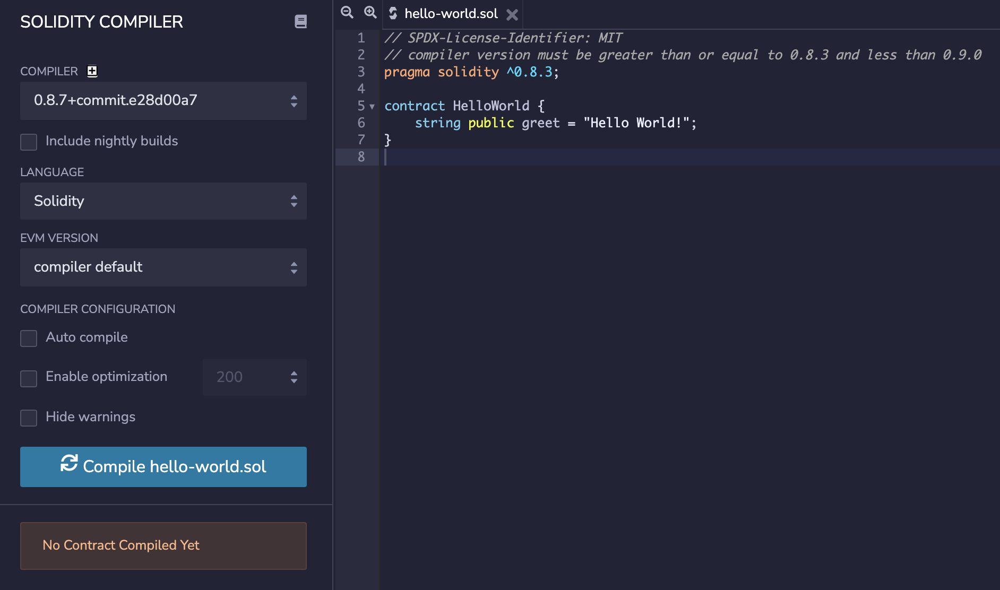
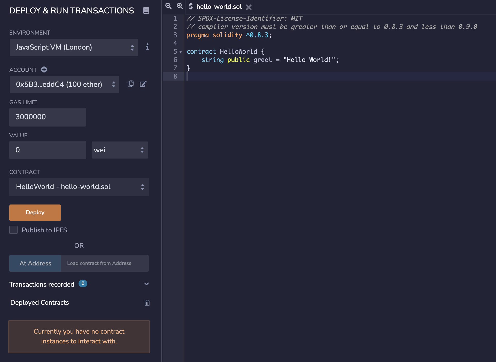
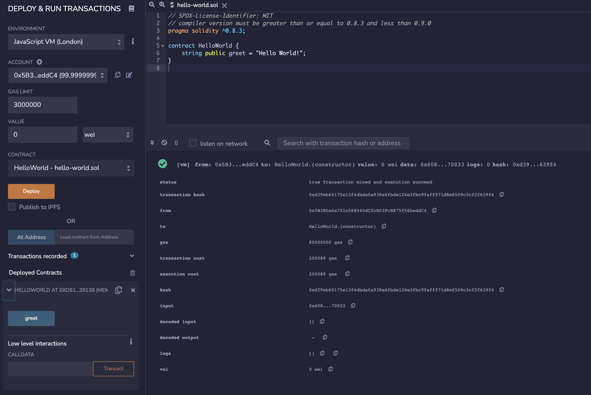
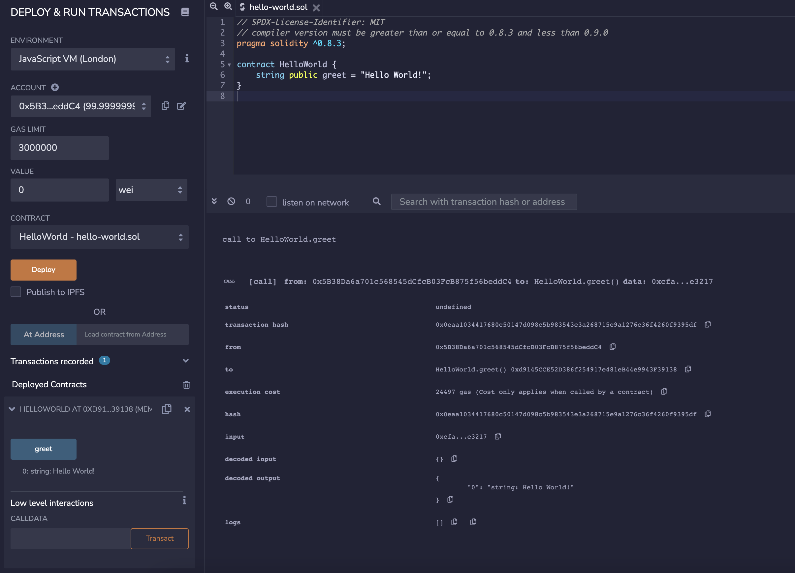

# Laboratory 10 - Smart Contracts and Cryptocurrencies

## Smart Contracts

**Smart Contracts** are simply programs stored on a blockchain that run when predetermined conditions are met. They typically are used to automate the execution of an agreement so that all participants can be immediately certain of the outcome, without any intermediary's involvement or time loss.

**Solidity** is an object-oriented programming language for writing smart contracts. It is a high level language that is a combination of JavaScript, Java, and C++. It is used for implementing smart contracts on various blockchain platforms, most notably, Ethereum.

**Remix** is a browser-based compiler and IDE that enables users to build Ethereum contracts with Solidity language and to debug transactions.

Let's take the following example:

```
// SPDX-License-Identifier: MIT
pragma solidity 0.8.22;

contract HelloWorld {
    string public greet = "Hello World!";
}
```

Open the remix IDE (https://remix.ethereum.org/), copy the above code and click the ```Compile <file>.sol``` button.



Once compiled, we are going to deploy our smart contract to the blockchain by clicking the ```Deploy``` button.



We can see the transaction details in the following picture:



We defined one variable as ```public``` in our smart contract, if we click on the ```greet``` button on the left side, we can see its content and the transaction details:



---

### Ex. 1 - Store and retrieve data (1p)

* Create a contract that stores a person's name in a string variable and can greet him/her:
    * Create two functions, ```store``` and ```retrieve```, to store and retrieve the person's name.
    * Create a function, ```greetings```, to greet him/her, returning ```"Hello <name>!"```.
    * The person's name cannot be empty.

---

### Ex. 2 - Temporary blocking (0.5p)

* Create a contract that stores the money of a company, which can be added and withdrawn:
    * The company has initially 100.000 CZK.
    * The maximum amount of money that can be added each time is 10.000 CZK.
    * The maximum amount of money that can be withdrawn each time is 20% of the total balance.
    * The money can only be withdrawn once every minute.

---

### Ex. 3 - Ownership (0.5p)

* Create a contract that allows for a change of ownership.
    * It must have a method only callable by the current owner.
    * It must have a method to know the current owner.

---

## Cryptocurrencies

ERC20 is a technical standard used for smart contracts on the Ethereum blockchain for implementing tokens.
If a Smart Contract implements the following methods and events it can be called an ERC-20 Token Contract and, once deployed, it will be responsible to keep track of the created tokens on Ethereum.

**Functions**:

```
function name() public view returns (string)
function symbol() public view returns (string)
function decimals() public view returns (uint8)
function totalSupply() public view returns (uint256)
function balanceOf(address _owner) public view returns (uint256 balance)
function transfer(address _to, uint256 _value) public returns (bool success)
function transferFrom(address _from, address _to, uint256 _value) public returns (bool success)
function approve(address _spender, uint256 _value) public returns (bool success)
function allowance(address _owner, address _spender) public view returns (uint256 remaining)
```

**Events**:

```
event Transfer(address indexed _from, address indexed _to, uint256 _value)
event Approval(address indexed _owner, address indexed _spender, uint256 _value)
```

---

### Hw. 1 - MOK Token

* Create your own token by implementing the above functions and events.
    * Use the following website as a reference: https://eips.ethereum.org/EIPS/eip-20

---
